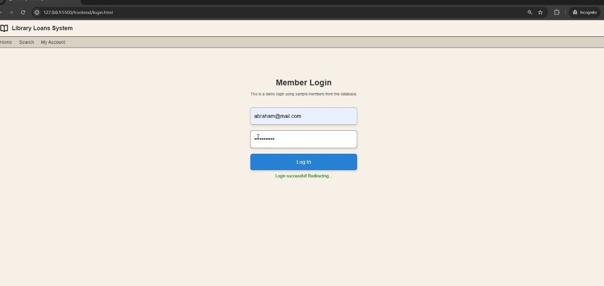
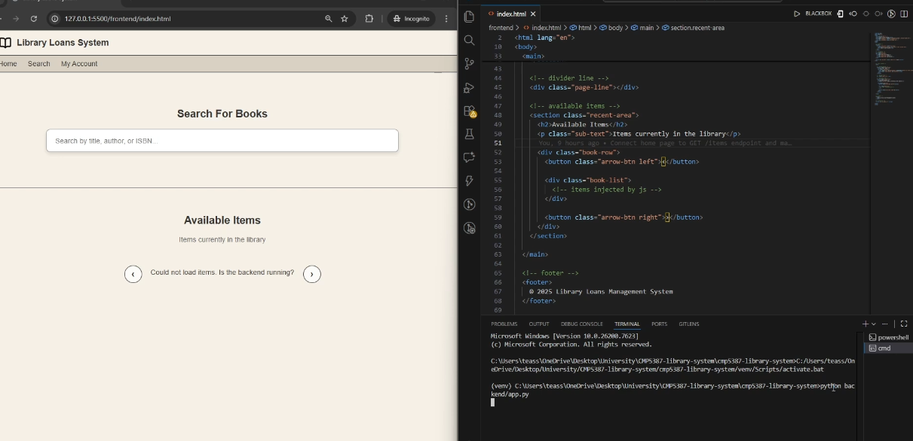
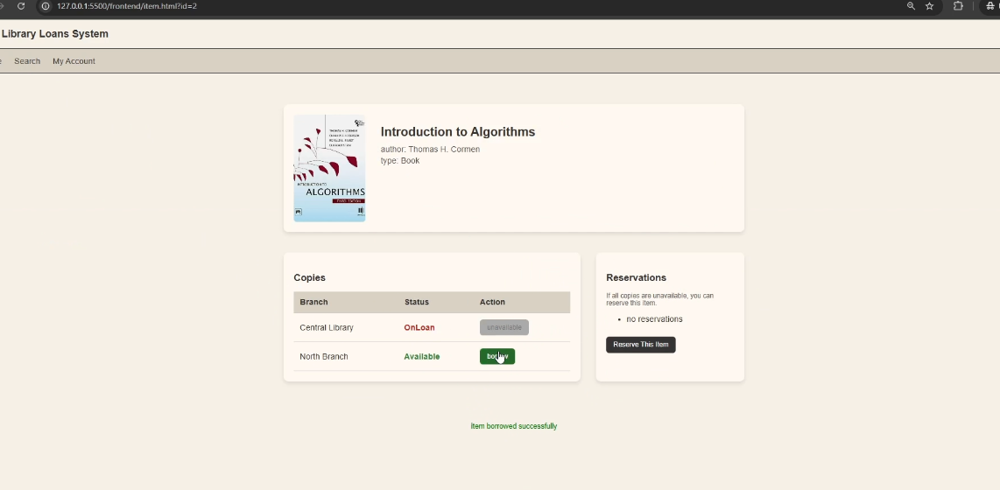
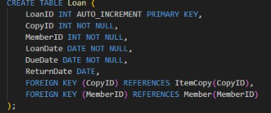

# CMP5387 Library Loans Management System
## Project Overview
This project implements a Library Loans Management System designed to solve common problems faced by libraries operating across multiple branches. These include inconsistent availability information, manual enforcement of borrowing rules, and difficulty tracking loans, reservations, and overdue items.

The system uses a single central backend and database. All business rules are enforced on the server side, ensuring consistent behaviour regardless of how the frontend is used. Both library members and staff access the same backend services through a RESTful API.

---

## System Architecture
The system follows a standard three-tier architecture:

1. **Frontend:** HTML, CSS, and JavaScript.
2. **Middleware:** Flask REST API (Python).
3. **Database:** MySQL relational database.

All borrowing, reservation, and availability logic is implemented in the backend. The frontend is responsible only for displaying data and collecting user input via HTTP (JSON) requests.

---

## Project Structure
The project is organised into three main parts:

* **backend/**: Contains the Flask application and API routes.
* **database/**: Contains SQL scripts for schema creation, sample data, and demo resets.
* **frontend/**: Contains HTML, CSS, JavaScript, and assets for the user interface.
* **.env**: Used for storing environment variables and database credentials.

---

## Setup Instructions

### Prerequisites
* Python 3.x
* MySQL Server
* MySQL Workbench
* VS Code with "Live Server" extension installed

### Database Configuration
1. Run the schema SQL file to create the database structure.
2. **sample_data.sql**: Run this for the initial population of members and library items.
3. **demo_reset.sql**: Use this script for repeated demos or testing to clear active loans and reservations while keeping the core library catalog intact.

### Backend Execution
To start the backend server on Windows:

1. Open a terminal in the project root. In VS Code, select **Terminal > New Terminal**.
2. Navigate to the backend folder using the command: `cd backend`
3. Activate the virtual environment using: `venv\Scripts\activate`
   (You should see `(venv)` at the start of the terminal line).
4. Install dependencies (optional but recommended) using: `pip install -r requirements.txt`
5. Run the Flask application using: `python app.py`
6. Confirm the server is running. You should see a message stating "Running on http://127.0.0.1:5000".
7. Test the connection by opening `http://127.0.0.1:5000/items` in your browser. If JSON data appears, the backend is running successfully.

*Note for macOS users:* Use `source venv/bin/activate` to enable the environment, then run `python app.py`.

### Frontend Execution
The frontend consists of static web pages.
To run the frontend interface:

1. Ensure the **Live Server** extension is installed in VS Code.
2. Navigate to the **frontend/** folder in your file explorer.
3. Right-click on the primary HTML file (`index.html`).
4. Select **Open with Live Server**.
5. The application will launch automatically in your default web browser and connect to the running backend.

---

## Backend Business Logic
To ensure data integrity and consistent rule enforcement, the backend manages the following:

* **Availability:** Items can only be borrowed if a physical copy is currently available.
* **Concurrency:** A specific copy can only be on loan to one member at a time.
* **Borrowing Caps:** Members are limited by a maximum number of simultaneous loans.
* **Automation:** Due dates and overdue statuses are calculated automatically by the server.
* **Reservations:** Requests can only be placed when all copies are unavailable. Duplicate reservations are prevented.

---

## Reservation Design
Reservations are based on queue order rather than predicted return times. The reservation date records when the request was made and is not changed if items are returned early. This avoids unfair priority changes and keeps the system predictable and fair for all members.

---

## Future Improvements
* Implementation of secure JWT or Session authentication.
* Introduction of distinct Staff and Member roles.
* Automated email/system notifications for overdue items and available reservations.
* Enhanced frontend features including advanced filtering and pagination.
* Automatic reservation fulfilment logic when an item is checked back in.

## Screenshots

---

